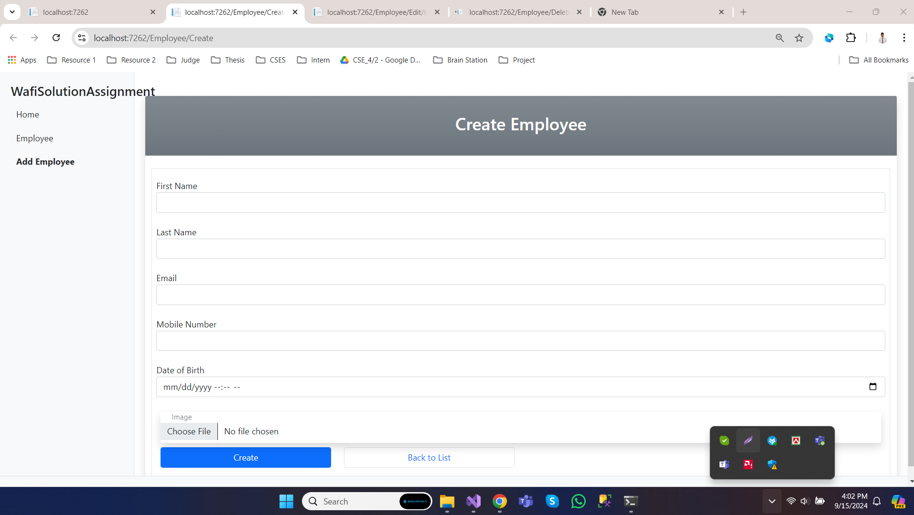
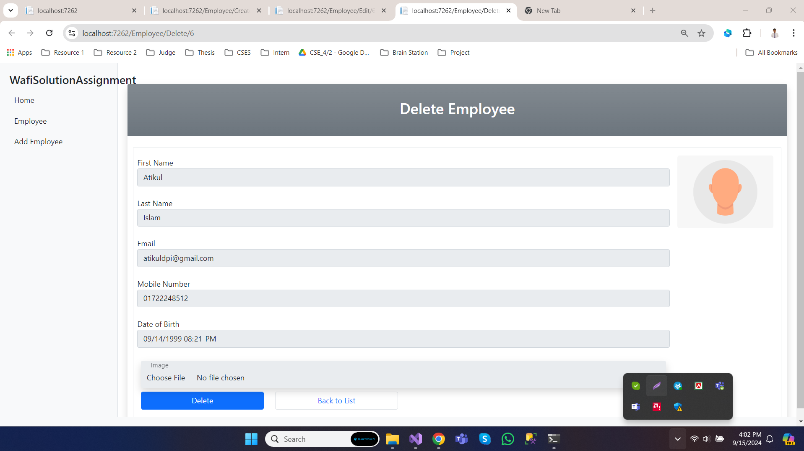

# WafiSolutionAssignment
 

# How to Run the code

### Copy the Github reposity and clone it into your visual stdio code and run the solution.  

 

### Index Page for show all Employees

 

### Create Page for Create new Employee

 

### Edit Page for Edit the Employee

 

### Delete Page for Delete the Employee

